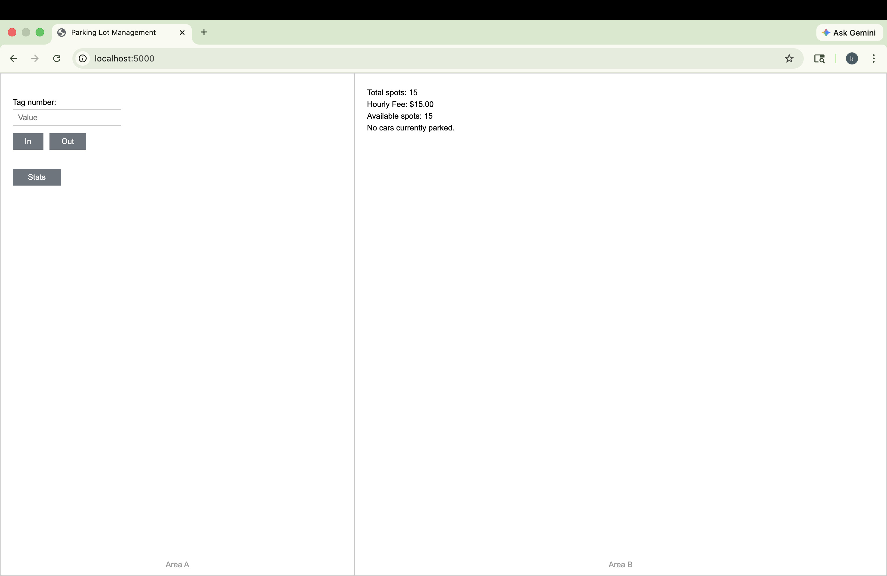
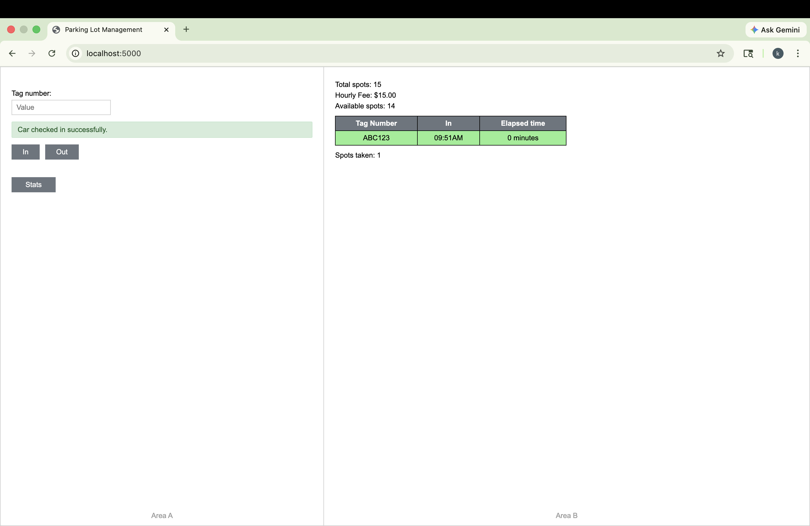
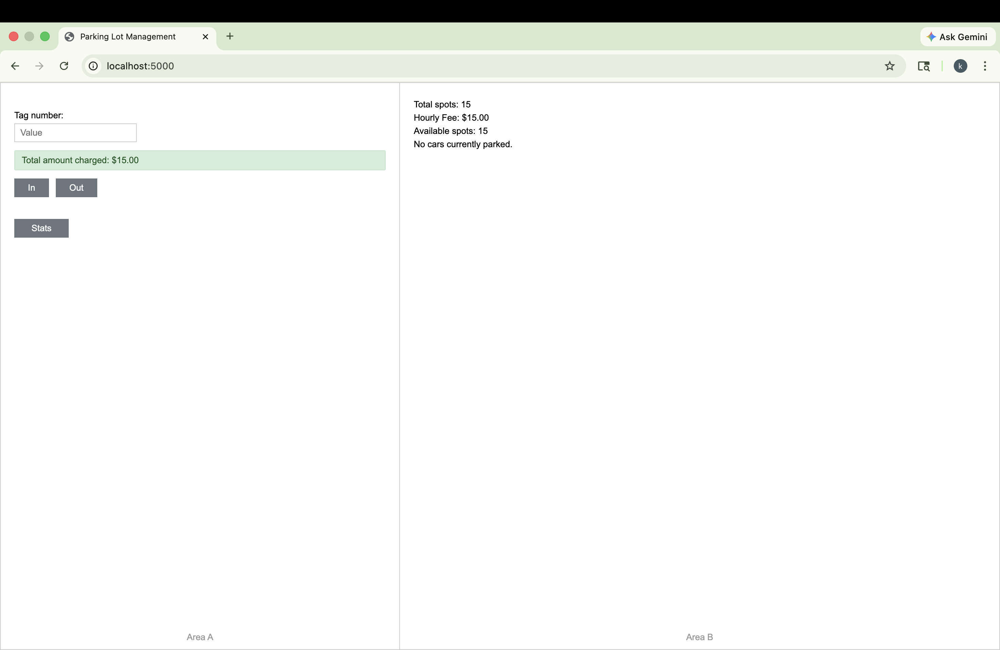
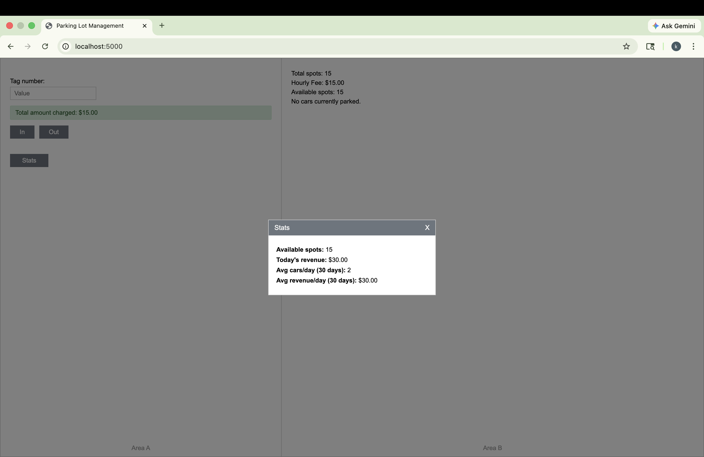
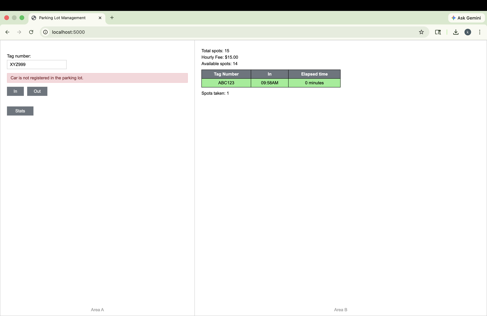
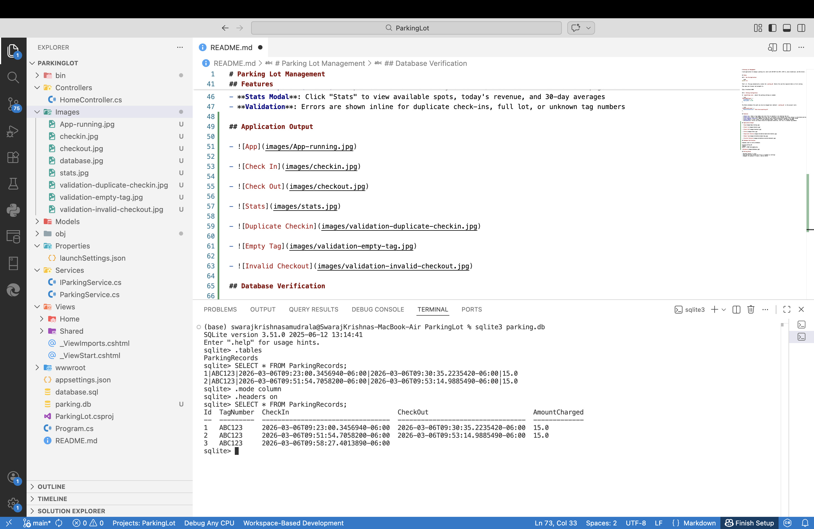

# Parking Lot Management



A web application to manage a parking lot, built with ASP.NET Core MVC (.NET 8), plain JavaScript, and SQLite.

The application allows vehicles to check in and check out, calculates parking charges, tracks parking statistics, and stores records in a SQLite database.

## Tech Stack

- ASP.NET Core MVC (.NET 8)
- SQLite Database
- C#
- JavaScript (AJAX)
- HTML / CSS

## Setup

### 1. Run the Application

```bash
dotnet run
```

That's it. The app automatically creates the `parking.db` SQLite file and the required table on first startup.

Then open your browser and navigate to:

```
http://localhost:5000
```

### 2. Parking Configuration

In `appsettings.json`, adjust the parking settings as needed:

```json
"ParkingSettings": {
  "TotalSpots": 15,
  "HourlyFee": 15.00
}
```

The SQLite database file path can also be changed here (default: `parking.db` in the project root):

```json
"ConnectionStrings": {
  "DefaultConnection": "Data Source=parking.db"
}
```

## Features

- **Check In**: Enter a tag number and click "In" to register a car entering the lot
- **Check Out**: Enter a tag number and click "Out" to process a car leaving. The total charge is calculated and displayed
- **Live Snapshot (Area B)**: Updates via AJAX on every check-in/check-out without a full page reload
- **Stats Modal**: Click "Stats" to view available spots, today's revenue, and 30-day averages
- **Validation**: Errors are shown inline for duplicate check-ins, full lot, or unknown tag numbers

## Application Output

### Application Running


### Car Check-In


### Car Check-Out


### Stats Window


### Duplicate Check-In Validation


### Empty Tag Validation


### Invalid Checkout Validation


## Database Verification

- The SQLite database `parking.db` stores all parking records.

- Commands used to verify the database:

```bash
sqlite3 parking.db
.tables
.mode column
.headers on
SELECT * FROM ParkingRecords;
```

- 

## Billing Rules

- Minimum charge is 1 hour
- Each partial hour beyond the first is rounded up (ceiling)
- Example: 61 minutes = 2 hours = $30 at $15/hr

